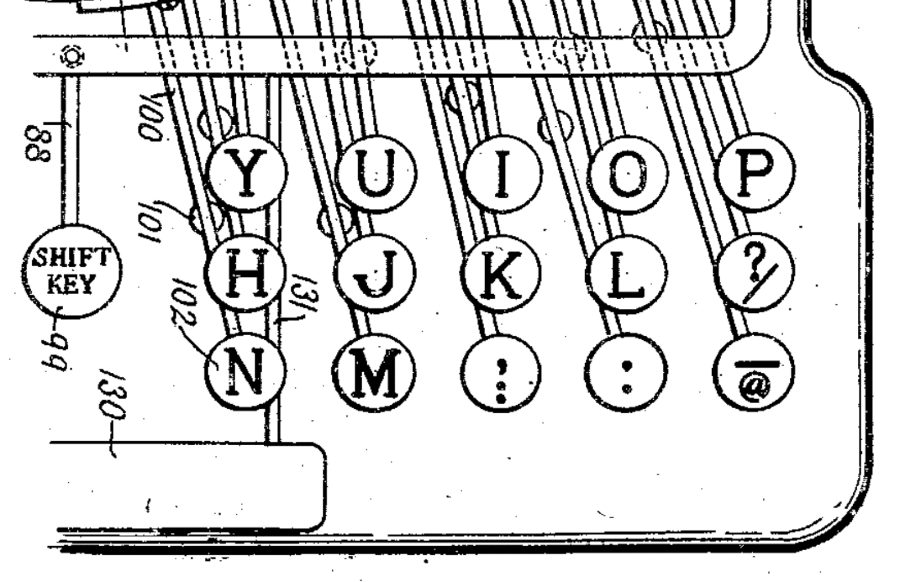

# Historic Ergonomic keyboard layout from patents

## Notes

## Patents

### 1898 US637334A - Type-writing machine

**Authors**: Edward B Hess, Oluf Tyberg **Submission**: 1898-08-19 **Published**: 1899-11-21

**Claims**: "This invention relates to that class of typewriting machines in which pivoted type bars are each provided with a plurality of type or characters arranged **longitudinally thereon** and each bar operated upon through the medium of a plurality of finger-keys, one for each character, ..."

**Notes**: Even though this is an orthogonal layout this is due to technological nature and not for better ergonomics

[PDF](files/patents/US637334A.pdf)

[Google Scholar](https://patents.google.com/patent/US637334A/)
[FreePatentsOnline](https://www.freepatentsonline.com/0637334.html)
[Espacenet](https://worldwide.espacenet.com/patent/search/family/002705923/publication/US637334A?q=pn%3DUS637334A)

Images: None (because it is not a layout)

### 1922 US1598028A - Typewriter movement 

**Authors**: Oluf Tyberg **Submission**: 1922-05-29 **Published**: 1926-08-31

**Claims**: TODO

**Notes**: Even though this is an orthogonal layout this is due to technological nature and not for better ergonomics

[PDF](files/patents/US1598028A.pdf)

[Google Scholar](https://patents.google.com/patent/US1598028A/)
[FreePatentsOnline](https://www.freepatentsonline.com/1652464.html)
[Espacenet](https://worldwide.espacenet.com/patent/search/family/024255314/publication/US1598028A?q=pn%3DUS1598028A)

Images: 

