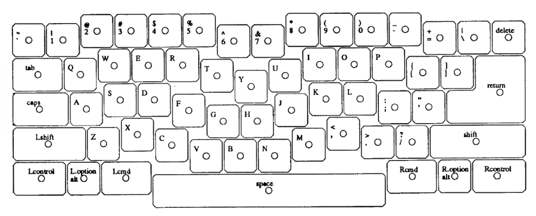

# Historic Ergonomic keyboard layout from patents

## Notes

### How to find relevant patents

The easiest way is to go to (Google Patents)[https://patents.google.com/] and search for stuff like 'ergonomic keyboard'.

If you already have a patent and you want to find 

Patents are classified by categories. one category which contains typing layouts is (B41J5/10)[https://patents.google.com/?q=(B41J5%2f10)&sort=old]. You can search for patents of such type in Google Patents.

The whole list of patent classifications for typewriters can be found here:

https://www.uspto.gov/web/patents/classification/cpc/html/cpc-B41J.html#B41J5/00

The whole list of patent classifications for computers can be found here:

https://www.uspto.gov/web/patents/classification/cpc/html/cpc-G06F.html#G06F3/00

If you have a patent and you want to figure out if there are newer patents which references it you can go to Google Patents or Free Patents Online and look it up

A lot of patents related to keyboards can be found here:

* https://deskthority.net/wiki/Keyboard_patents

* https://deskthority.net/wiki/Orthogonal_input_keyboards#cite_note-1

* https://deskthority.net/wiki/Category:Patents

# Patents

## 1890

### 1896 - US556422A - Machines

**Authors**: Albrecht von Kunowski **Submission**: 1896-03-17 **Published**: 1896-03-17

**Claims**: "The keyboards for type-writing machines commonly used have the disadvantage that on account of the rectangular or semicircular shape of the board in actuating the type-writing machine the lower arm has to be shifted, because the keys cannot be reached by the sole movement of the fingers while the arm is at rest. This disadvantage is avoided in the so-called stenographic type -writing machines, in which the keys are arranged in two curved lines symmetrically to the center line of the keyboard. Arrangements of this kind, however, permit of employing only a comparatively restricted number of keys and therefore cannot be used for ordinary typewriting machines.

My invention relates to an improved keyboard, in which both inconveniences are obviated by arranging the keys in four curved lines, which I call guiding-lines, the two innermost of which are the guiding-lines of the thumbsand correspond to a curve described by the point of the thumb when spreading it away from the hand."

**Notes**: I am not sure if this is truly for a typewriter or more for a stenographic machine

[PDF](files/patents/US556422A.pdf) -
[Google Patents](https://patents.google.com/patent/US556422A/en) -
[Espacenet](https://worldwide.espacenet.com/patent/search/family/002625159/publication/US556422A?q=pn%3DUS556422A)

### 1898 - US637334A - Type-writing machine

**Authors**: Edward B Hess, Oluf Tyberg **Submission**: 1898-08-19 **Published**: 1899-11-21

**Claims**: "This invention relates to that class of typewriting machines in which pivoted type bars are each provided with a plurality of type or characters arranged **longitudinally thereon** and each bar operated upon through the medium of a plurality of finger-keys, one for each character, ..."

**Notes**: Even though this is an orthogonal layout this is due to technological nature and not for better ergonomics

[PDF](files/patents/US637334A.pdf) -
[Google Patents](https://patents.google.com/patent/US637334A/) -
[FreePatentsOnline](https://www.freepatentsonline.com/0637334.html) -
[Espacenet](https://worldwide.espacenet.com/patent/search/family/002705923/publication/US637334A?q=pn%3DUS637334A)

Images: None (because it is not a layout)

## 1900

## 1910

### 1910 - US1083076A - Type-writing machine

**Authors**: Oskar Fischer **Submission**: 1910-04-26 **Published**: 1913-12-30

**Claims**: TODO

**Notes**: I am not sure if this counts like some sort of ergonomic keyboard just yet. Oskar Fischer had a lot more patents about typewriters later in his life and those look more like ergonomic typewriters. Scrow down this list to see more of his work, e.g. US1553765A

[PDF](files/patents/US1083076A.pdf) -
[Google Patents](https://patents.google.com/patent/US1083076A/en) -
[FreePatentsOnline](https://www.freepatentsonline.com/1083076.html) -
[Espacenet](https://worldwide.espacenet.com/patent/search/family/003151307/publication/US1083076A?q=pn%3DUS1083076A)

### 1914 - US1138474A - Type-writing machine

**Authors**: Fritz Heidner **Submission**: 1914-03-18 **Published**: 1915-05-04

**Claims**: "This invention relates to improvements in the keyboards and key levers of typewriting machines, my object being to enable the operator to obtain a better View of the keys and to write with greater ease, in a less cramped position than ordinarily.

[...]

The novel arrangement of the keys is of great advantage from a hygienic point of view, as the forearms have no longer to be held in a more or less constrained position against the body, but remain perfectly free, so that the chest can be normally expanded. Moreover, owing to the parallel disposition of the forearms, the hands have not to be twisted outward to the same extent as for merly has been the case, and there being thus much less strain upon the abducent muscles, writing is rendered considerably less fatiguing."

**Notes**: TODO

[PDF](files/patents/US1138474A.pdf) -
[Google Patents](https://patents.google.com/patent/US1138474A/en) -
[FreePatentsOnline](https://www.freepatentsonline.com/1138474.html) -
[Espacenet](https://worldwide.espacenet.com/patent/search/family/003206571/publication/US1138474A?q=pn%3DUS1138474A)

## 1920

### 1922 - US1598028A - Typewriter movement 

**Authors**: Oluf Tyberg **Submission**: 1922-05-29 **Published**: 1926-08-31

**Claims**: TODO

**Notes**: Even though this is an orthogonal layout this is due to technological nature and not for better ergonomics

[PDF](files/patents/US1598028A.pdf) -
[Google Patents](https://patents.google.com/patent/US1598028A/) -
[FreePatentsOnline](https://www.freepatentsonline.com/1652464.html) -
[Espacenet](https://worldwide.espacenet.com/patent/search/family/024255314/publication/US1598028A?q=pn%3DUS1598028A)

### 1924 - US1553765A - Typewriting machine  

**Authors**: Fischer Oskar **Submission**: 1924-01-25 **Published**: 1925-09-15

**Claims**: TODO

**Notes**: This is not the first of his patents with this sort of keyboard. There is a much earlier one which looks similar, see US1083076A

[PDF](files/patents/US1553765A.pdf) -
[Google Patents](https://patents.google.com/patent/US1553765A/en) -
[FreePatentsOnline](https://www.freepatentsonline.com/1553765.html) -
[Espacenet](https://worldwide.espacenet.com/patent/search?q=pn%3DUS1553765A)

### 1925 - US1672354A - Power typewriter

**Authors**: Oluf Tyberg **Submission**: 1925-03-06 **Published**: 1928-06-05

**Claims**: TODO

**Notes**: Even though this is an orthogonal layout this is due to technological nature and not for better ergonomics

[PDF](files/patents/US1672354A.pdf) -
[Google Patents](https://patents.google.com/patent/US1672354A/) -
[FreePatentsOnline](https://www.freepatentsonline.com/1672354.html) -
[Espacenet](https://worldwide.espacenet.com/patent/search/family/021760836/publication/US1672354A?q=pn%3DUS1672354A)

### 1926 - US1652464A - Typewriter keyboard

**Authors**: Oluf Tyberg **Submission**: 1926-02-08 **Published**: 1927-12-13

**Claims**: "One object of this invention is to construct a keyboard in such a manner that all the automatic motions ot a machine of this nature can be controlled by the operator **with the least possible motion of the hands**.

Another object is embodied in a new and useful grouping of the printing-keys, that will make their operation by touch easier to master, and which will generally **tend to improve both speed and accuracy**."

**Notes**: In contrast to his earlier patents related to this layout this is the first time he specifically mentions ergonomics as a reason for this layout

[PDF](files/patents/US1652464A.pdf) -
[Google Patents](https://patents.google.com/patent/US1652464A/) -
[FreePatentsOnline](https://www.freepatentsonline.com/1652464.html) -
[Espacenet](https://worldwide.espacenet.com/patent/search/family/022201098/publication/US1652464A?q=pn%3DUS1652464A)

## 1930

### 1932 - US2040248A - Typewriter keyboard 

**Authors**: Dvorak August, William L Dealey **Submission**: 1932-05-21 **Published**: 1936-05-12

**Claims**: This is the patent for the Dvorak layout

**Notes**: Todo

[PDF](files/patents/US2040248A.pdf) -
[Google Patents](https://patents.google.com/patent/US2040248A/en) -
[FreePatentsOnline](https://www.freepatentsonline.com/2040248.html) -
[Espacenet](https://worldwide.espacenet.com/patent/search/family/024454455/publication/US2040248A?q=pn%3DUS2040248A)

## 1940

## 1950

## 1960

### 1963 - DE1279693B / GB1016993A - In zwei spiegelbildliche Felder unterteilte Normentastatur

**Authors**: Jim Ladue, Werner Seydel **Company**: IBM **Submission**: 1963-09-28 **Published**: 1968-10-10

**Claims**: TODO

**Notes**: TODO

[PDF DE](files/patents/DE1279693B.pdf) -
[Google Patents DE](https://patents.google.com/patent/DE1279693B/) -
[Espacenet DE](https://worldwide.espacenet.com/patent/search/family/007201828/publication/DE1279693B?q=pn%3DDE1279693B)

[PDF GB](files/patents/GB1016993A.pdf) -
[Google Patents GB](https://patents.google.com/patent/GB1016993A/) -
[Espacenet GB](https://worldwide.espacenet.com/patent/search/family/007201828/publication/GB1016993A?q=pn%3DGB1016993A)

## 1970

### 1973 - US3929216A - Input keyboards 

**Authors**: Harvey Einbinder **Submission**: 1973-09-04 **Published**: 1975-12-30

**Claims**: "The keyboards are split into rotated halves containing curved key rows and slanted key tops of variable height **to follow the architecture of the hand**."

**Notes**: Todo

[PDF](files/patents/US3929216A.pdf) -
[Google Patents](https://patents.google.com/patent/US3929216A/en) -
[Espacenet](https://worldwide.espacenet.com/patent/search/family/023559289/publication/US3929216A?q=pn%3DUS3929216A)

### 1973 - US3945482A - Orthogonal input keyboards 

**Authors**: Harvey Einbinder **Submission**: 1973-12-14 **Published**: 1976-03-23

**Claims**: "Orthogonal ten-finger keyboards are disclosed for typewriters, computer terminals, and other devices processing alphanumeric information that maximize entry rates and stroking accuracy-and minimize finger motions and the time needed to master the keyboard."

**Notes**: Also mentioned on the Deskthority Wiki: https://deskthority.net/wiki/Orthogonal_input_keyboards

[PDF](files/patents/US3945482A.pdf) -
[Google Patents](https://patents.google.com/patent/US3945482A/en) -
[FreePatentsOnline](https://www.freepatentsonline.com/3945482.html) -
[Espacenet](https://worldwide.espacenet.com/patent/search/family/023683917/publication/US3945482A?q=pn%3DUS3945482A)

## 1980

### 1984 - US4579470A - Keyboard with keys concentrated in clusters 

**Authors**: Cullen Casey **Submission**: 1984-04-11 **Published**: 1986-04-01

**Claims**: "A keyboard usable on a typewriter or a computer terminal and configured in accordance with ergonomic principles uses chording of one thumb and one finger to type the characters of the English alphabet. The keyboard includes right and left preloaded palm pads which are shaped and contoured to fit the hands. The palm pads support the hands and operate the SHIFT and SHIFT LOCK functions."

**Notes**: This is not a classic ergonomic keyboard layout but uses the combination of several key presses to creates letters

[PDF](files/patents/US4579470A.pdf) -
[Google Patents](https://patents.google.com/patent/US4579470A/) -
[Espacenet](https://worldwide.espacenet.com/patent/search/family/024398020/publication/US4579470A?q=pn%3DUS4579470A)

### 1986 - US5017030A - Ergonomically designed keyboard 

**Authors**: Jay A. Crews **Submission**: 1986-07-07 **Published**: 1991-05-21

**Claims**: "A keyboard usable on a typewriter or a computer terminal and configured in accordance with ergonomic principles uses chording of one thumb and one finger to type the characters of the English alphabet. The keyboard includes right and left preloaded palm pads which are shaped and contoured to fit the hands. The palm pads support the hands and operate the SHIFT and SHIFT LOCK functions."

**Notes**: This is not a classic ergonomic keyboard layout but uses the combination of several key presses to creates letters

[PDF](files/patents/US5017030A.pdf) -
[Google Patents](https://patents.google.com/patent/US5017030A/en) -
[Espacenet](https://worldwide.espacenet.com/patent/search/family/025381006/publication/US5017030A?q=pn%3DUS5017030A)

## 1990

### 1992 - - WO1993007738A2 US5716149A US5971636A - Ergonomically improved standard keyboard 

**Authors**: John Mensick **Submission**: 1992-10-22 **Published**: 1993-04-29

**Claims**: "An approach to keyboard development is described which integrates ergonomic modification with the psychological resistance to changing existing, familiar keyboard designs."

**Notes**: This is a neat modification of the standard row staggered layout

(this is 3 different patens covering 1992 to 1999, The world patent is the earliest, the other two are later)

[PDF](files/patents/US5971636A.pdf) -
[Google Patents](https://patents.google.com/patent/WO1993007738A2/en) -
[FreePatentsOnline](https://www.freepatentsonline.com/5971636.html) -
[Espacenet](https://worldwide.espacenet.com/patent/search/family/026725265/publication/US5971636A?q=pn%3DUS5971636A)

### 1994 - US5476332A - Symmetrical keyboard apparatus 

**Authors**: Ralph H. Cleveland, Jr. **Submission**: 1994-05-31 **Published**: 1995-12-19

**Claims**: "A symmetrical keyboard for computers, [...] wherein five rows of transverse keys are positioned and oriented in order to allow a user to **move his or her left hand in a natural way** that does not require unnatural "crabbing" (i.e. upward to the left and downward to the right) motions from the user's left hand."

**Notes**: TODO

[PDF](files/patents/US5476332A.pdf) -
[Google Patents](https://patents.google.com/patent/US5476332A/) -
[Espacenet](https://worldwide.espacenet.com/patent/search/family/022951393/publication/US5476332A?q=pn%3DUS5476332A)

